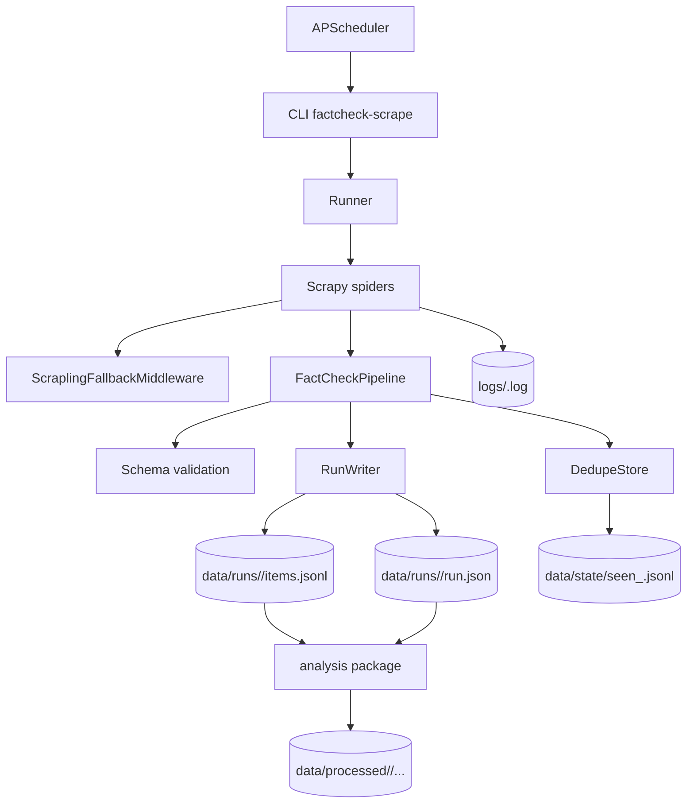

# FactCheck Scrape

Pipeline de web scraping para agencias e editorias de fact-checking, com coleta padronizada em JSONL, deduplicacao por URL canonica, logs estruturados e uma trilha de analise processada para notebooks e export consolidado.

## O que o projeto faz

- executa spiders Scrapy por agencia;
- valida o schema bruto antes de persistir os itens;
- evita duplicatas com estado historico por agencia e deduplicacao dentro do run atual;
- grava artefatos rastreaveis por execucao em `data/runs/<run_id>/`;
- permite agendamento via APScheduler;
- oferece fallback opt-in com Scrapling para paginas que aparentam bloqueio anti-bot;
- prepara datasets processados com limpeza, normalizacao, NLP e `manifest.json`.

## Arquitetura



## Fontes suportadas

- `afp_checamos`
- `agencia_lupa`
- `aos_fatos`
- `boatos_org`
- `e_farsas`
- `estadao_verifica`
- `g1_fato_ou_fake`
- `observador`
- `poligrafo`
- `projeto_comprova`
- `publico`
- `reuters_fact_check`
- `uol_confere`

## Requisitos

- Python 3.12
- `uv`

## Instalacao

Ambiente base:

```bash
uv venv
source .venv/bin/activate
uv pip install -e ".[dev]"
```

Extras opcionais:

- analise e notebooks:

```bash
uv pip install -e ".[analysis]"
uv run python -m spacy download pt_core_news_lg
```

- fallback anti-bot com Scrapling:

```bash
uv pip install -e ".[scrapling]"
scrapling install --force
```

## Uso rapido

Listar spiders:

```bash
factcheck-scrape list
```

Executar uma spider:

```bash
factcheck-scrape run --spider reuters_fact_check
```

Executar todas as spiders:

```bash
factcheck-scrape run --spider all
```

Recoletar uma agencia ignorando o estado historico de deduplicacao:

```bash
factcheck-scrape run --spider observador --ignore-existing-seen-state
```

Agendar jobs com o arquivo padrao:

```bash
factcheck-scrape schedule --config configs/schedule.yaml
```

Abrir notebooks:

```bash
uv run jupyter lab
```

## Saidas do projeto

Coleta bruta por run:

- `data/runs/<run_id>/items.jsonl`
- `data/runs/<run_id>/run.json`

Estado de deduplicacao:

- `data/state/seen_<agency_id>.jsonl`

Snapshots processados:

- `data/processed/<snapshot_id>/spiders/<spider>.jsonl`
- `data/processed/<snapshot_id>/factcheck_scrape_unified.jsonl`
- `data/processed/<snapshot_id>/manifest.json`

Logs:

- `logs/<run_id>.log`

## Contrato e qualidade

O schema bruto padronizado fica em `docs/schema.json`. O pipeline exige campos obrigatorios como `item_id`, `agency_id`, `source_url`, `canonical_url`, `title`, `published_at`, `collected_at` e `run_id`.

Antes de persistir, a coleta aplica guardrails de qualidade:

- descarta itens com `title` vazio ou que repete a propria URL;
- descarta `published_at` vazio ou placeholders como `-` e variantes Unicode de traco;
- separa `verdict` humano de `rating` numerico quando a origem fornece `ClaimReview`;
- usa um backstop no pipeline para impedir persistencia degradada mesmo que uma spider futura relaxe a extracao.

## Estrutura do repositorio

- `src/factcheck_scrape/`: CLI, runner, pipeline, schema, storage, logging e spiders
- `src/factcheck_scrape/spiders/`: spiders por agencia
- `src/factcheck_scrape/analysis/`: selecao de runs, limpeza, normalizacao, NLP e export
- `configs/`: configuracoes de agendamento
- `docs/`: documentacao tecnica, guia de uso e schema
- `notebooks/`: notebooks de EDA e consolidacao do dataset processado
- `tests/`: testes unitarios e fixtures
- `data/`: runs brutos, estado de dedupe e snapshots processados
- `logs/`: logs estruturados por execucao

## Desenvolvimento

Rodar testes:

```bash
uv run pytest
```

Rodar lint:

```bash
uv run ruff check .
```

Formatar:

```bash
uv run ruff format .
```

## Documentacao relacionada

- `docs/user_guide.md`: instalacao, CLI, restricoes editoriais e fluxo operacional
- `docs/design.md`: arquitetura, diagrama Mermaid e decisoes do pipeline
- `docs/analysis.md`: regras do dataset processado e fluxo `raw -> processed`
- `docs/schema.json`: contrato do item bruto

## Versionamento

O projeto adota tags Git como fonte de verdade para releases, no formato `vMAJOR.MINOR.PATCH`. Mudancas relevantes devem atualizar a documentacao impactada e registrar seu efeito em `CHANGELOG.md`.
