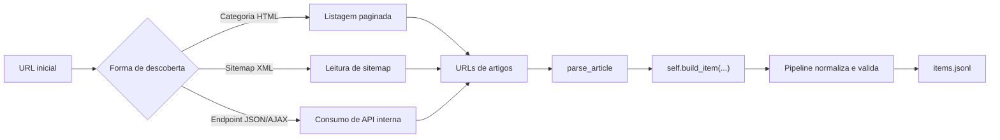

# Analise dos comentarios em `src/factcheck_scrape/spiders`

## Objetivo

Este documento analisa os comentarios deixados nas spiders da pasta `src/factcheck_scrape/spiders/`, descreve a solucao sugerida em cada arquivo, evidencia os dados ainda ausentes e lista as proximas etapas necessarias para uma implementacao completa.

Escopo desta analise:

- comentarios com instrucao explicita de coleta, paginacao, filtro ou uso de endpoint;
- estado atual do codigo no repositorio local;
- contrato de dados exigido pela base das spiders e pelo schema do projeto.

Esta analise foi feita apenas sobre o codigo local. Nao houve validacao online dos endpoints comentados. Quando houver inferencia, ela esta sinalizada como tal.

## Contrato minimo que toda spider precisa atender

O metodo `BaseFactCheckSpider.build_item(...)` em `src/factcheck_scrape/spiders/base.py:24-63` mostra o formato esperado para os itens produzidos pelas spiders. Ja o schema em `docs/schema.json:5-39` define os campos obrigatorios que precisam chegar validos ao pipeline.

Campos obrigatorios ou preenchidos ao longo do fluxo:

- `source_url`
- `canonical_url`
- `title`
- `published_at`
- `item_id`
- `agency_id`
- `agency_name`
- `spider`
- `collected_at`
- `run_id`

Campos opcionais, mas importantes para uma spider de fact-check:

- `claim`
- `summary`
- `verdict`
- `rating`
- `language`
- `country`
- `topics`
- `tags`
- `entities`
- `source_type`

Observacao importante:

- `run_id` pode ser injetado pelo pipeline em `src/factcheck_scrape/pipelines.py:107-123`.
- Mesmo assim, a spider precisa fornecer pelo menos uma URL confiavel, um titulo consistente e uma data de publicacao valida para produzir itens de qualidade.

## Fluxo comum esperado

## Visao geral

| Arquivo | Estado atual | Solucao sugerida no comentario | Lacuna principal |
| --- | --- | --- | --- |
| `afp_checamos.py` | Classe criada, `parse` pendente | Paginacao via endpoint AJAX do Drupal | Parametros estaveis do endpoint e parsing do retorno JSON/HTML |
| `agencia_lupa.py` | Classe criada, `parse` pendente | Categoria paginada em `/checagem/page/N/` | Extracao da listagem e do artigo |
| `aosfatos.py` | Classe criada, `parse` pendente | Busca/listagem filtrada por `formato=checagem&page=N` | `start_urls` ainda nao aponta para a fonte sugerida |
| `boatos_org.py` | So comentario | Navegacao por sitemap anual | Falta a spider inteira |
| `e_farsas.py` | So comentario | Coleta por paginas `/page/N` | Falta a spider inteira |
| `observador.py` | So comentario | Paginacao por endpoint JSON com `offset` | Falta a spider inteira e a semantica do cursor |
| `poligrafo.py` | So comentario | Categoria `/fact-checks/economia/` com `?paged=N/` | Falta a spider inteira e definicao do escopo |
| `projeto_comprova.py` | Classe criada, `parse` pendente | Paginacao por `/page/N/?filter=verificacao` | Falta extrair links e artigos |
| `publico.py` | So comentario | Sitemap + filtro por `/economia/` + meta `Prova dos Factos` | Falta a spider inteira e o filtro em pagina |
| `reuters_fact_check.py` | Classe criada, `parse` pendente | Paginacao por API interna da Reuters com `offset` | Parsing do JSON, anti-bot e extracao de artigo |

## Analise por spider

### `afp_checamos.py`

Referencia: `src/factcheck_scrape/spiders/afp_checamos.py:6-34`

O que o comentario sugere:

- a descoberta inicial deve partir de `https://checamos.afp.com/list`;
- a paginacao nao deve depender apenas do HTML da pagina, e sim de uma requisicao AJAX do Drupal em `/views/ajax`;
- o parametro `page=N` e o `view_name=rubriques` indicam que a listagem e provavelmente uma `View` paginada do Drupal.

Explicacao da solucao:

- a ideia e reproduzir a mesma chamada que o frontend faz ao clicar em paginas seguintes;
- isso tende a ser mais robusto para coletar a listagem do que tentar simular cliques visuais;
- a resposta provavelmente vem como JSON contendo fragmentos HTML com os cards dos artigos.

Dados ausentes:

- quais parametros da URL sao realmente obrigatorios e quais sao apenas artefatos capturados do navegador;
- em especial, `view_dom_id`, `ajax_page_state[libraries]` e o `Cookie` parecem dados volateis e nao deveriam ser hardcoded;
- o formato exato da resposta do endpoint e como extrair dela as URLs dos artigos;
- a regra de parada da paginacao;
- a estrategia de `parse_article`;
- os campos do item ainda sem mapeamento: `title`, `published_at`, `canonical_url`, `claim`, `summary`, `verdict`, `rating`, `language`, `country`, `topics`, `tags`, `entities`, `source_type`.

Proximas etapas:

1. Inspecionar a primeira pagina HTML para identificar links de artigos e, se necessario, os parametros dinamicos usados pela `View`.
2. Implementar `parse` para extrair os links da primeira pagina e agendar a primeira chamada AJAX.
3. Criar um parser para o payload JSON do Drupal e continuar a paginacao ate nao haver mais resultados.
4. Implementar `parse_article` com prioridade para JSON-LD, `meta` tags e titulo/subtitulo da pagina.
5. Adicionar testes para parse da pagina inicial, parse do payload AJAX e extracao de artigo.

### `agencia_lupa.py`

Referencia: `src/factcheck_scrape/spiders/agencia_lupa.py:6-17`

O que o comentario sugere:

- a coleta deve usar a categoria `https://www.agencialupa.org/checagem/`;
- a paginacao e do tipo path-based, por exemplo `/checagem/page/2/`.

Explicacao da solucao:

- o comentario aponta para uma estrategia simples: percorrer a categoria oficial de checagens pagina a pagina;
- isso reduz a necessidade de inferir quais artigos do dominio sao fact-checks, porque a propria categoria ja faz o recorte editorial.

Dados ausentes:

- seletor dos cards ou links de artigos em cada pagina da categoria;
- criterio de parada da paginacao ou seletor de `next page`;
- estrutura dos artigos para extrair `title`, `published_at` e `canonical_url`;
- local exato de `claim`, `summary`, `verdict` e `rating`, se existirem em JSON-LD ou no HTML;
- mapeamento de `language`, `country`, `topics`, `tags`, `entities` e `source_type`.

Proximas etapas:

1. Ajustar `parse` para coletar links da categoria `/checagem/`.
2. Seguir `/page/N/` ate esgotar a listagem ou ate o `next page` deixar de existir.
3. Implementar `parse_article` priorizando JSON-LD e metadados do WordPress.
4. Normalizar `country="BR"` e o idioma observado na pagina.
5. Criar testes para listagem e artigo.

### `aosfatos.py`

Referencia: `src/factcheck_scrape/spiders/aosfatos.py:6-18`

O que o comentario sugere:

- a fonte correta para a descoberta nao e a home do site;
- a coleta deve usar a listagem filtrada `https://www.aosfatos.org/noticias/?formato=checagem&page=2`.

Explicacao da solucao:

- a estrategia sugerida usa um filtro explicito de formato, o que evita ruido de outros tipos de conteudo;
- isso e melhor do que depender da homepage atual em `start_urls`, porque a home mistura secoes e tende a ser instavel.

Dados ausentes:

- o `start_urls` ainda nao reflete a URL sugerida no comentario;
- nao esta definido se a pagina 1 deve ser `...?formato=checagem` ou `...?formato=checagem&page=1`;
- faltam os seletores de listagem e a regra de paginacao;
- faltam os extratores de artigo para `title`, `published_at`, `canonical_url`, `claim`, `summary`, `verdict`, `rating`, `language`, `country`, `topics`, `tags`, `entities` e `source_type`.

Proximas etapas:

1. Alterar a origem da spider para a listagem filtrada por `formato=checagem`.
2. Implementar a coleta de links da pagina atual e a progressao de `page=N`.
3. Implementar `parse_article` e verificar se o site expoe `ClaimReview` em JSON-LD.
4. Adicionar testes para a listagem filtrada e para o parse do artigo.

### `boatos_org.py`

Referencia: `src/factcheck_scrape/spiders/boatos_org.py:1-2`

O que o comentario sugere:

- a descoberta deve partir de sitemaps anuais no formato `www.boatos.org/sitemap-posttype-post.AAAA.xml`;
- o ano deve ser substituido conforme a janela de coleta desejada.

Explicacao da solucao:

- o comentario sugere uma estrategia de cobertura historica por sitemap, que costuma ser mais completa do que paginacao visual em blogs antigos;
- como o dominio e orientado ao mesmo tipo de conteudo, a filtragem inicial pode ser mais simples do que em portais generalistas.

Dados ausentes:

- nao existe classe de spider, `name`, `agency_id`, `agency_name`, `allowed_domains` ou `start_urls`;
- nao existe politica para descobrir automaticamente os anos disponiveis;
- nao existe parser de sitemap nem parser de artigo;
- nao ha mapeamento de nenhum campo do item.

Proximas etapas:

1. Criar `BoatosOrgSpider` herdando de `BaseFactCheckSpider`.
2. Definir a estrategia de descoberta dos anos:
   - opcao simples: iterar de um ano inicial conhecido ate o ano atual;
   - opcao mais robusta: descobrir um sitemap index, se existir.
3. Implementar `parse_sitemap` para iterar URLs de artigo.
4. Implementar `parse_article` com extracao de campos do schema do projeto.
5. Adicionar testes para sitemap anual e pagina de artigo.

### `e_farsas.py`

Referencia: `src/factcheck_scrape/spiders/e_farsas.py:1`

O que o comentario sugere:

- a coleta deve partir de paginas do tipo `https://www.e-farsas.com/page/2`.

Explicacao da solucao:

- o comentario aponta para uma paginacao tradicional de blog;
- a implementacao deve percorrer as paginas de arquivo para coletar as URLs dos posts.

Dados ausentes:

- nao existe classe de spider;
- nao estao definidos `allowed_domains`, `start_urls` e o nome da spider;
- nao ha seletor de links dos artigos;
- nao ha criterio de parada da paginacao;
- nao ha parser de artigo nem mapeamento dos campos do item.

Proximas etapas:

1. Criar a spider com origem na pagina inicial do site.
2. Implementar a navegacao por `/page/N`.
3. Extrair links de posts evitando duplicatas.
4. Implementar `parse_article` e mapear os campos exigidos pelo schema.
5. Adicionar testes de listagem e artigo.

### `observador.py`

Referencia: `src/factcheck_scrape/spiders/observador.py:1-18`

O que o comentario sugere:

- a coleta deve partir de `https://observador.pt/factchecks/`;
- a paginacao pode ser feita por um endpoint JSON em `wp-json/obs_api/v4/grids/filter/archive/obs_factcheck`;
- o parametro `offset=20260217` indica um cursor ou marcador temporal;
- `scroll=true` sugere um comportamento de infinite scroll.

Explicacao da solucao:

- a estrategia evita depender de scroll em navegador e usa o endpoint interno ja preparado pelo site;
- para sites com listagem dinamica, isso costuma ser mais estavel do que parsear apenas o HTML renderizado inicialmente.

Dados ausentes:

- nao existe classe de spider;
- o significado exato do `offset` nao esta documentado no comentario e precisa ser confirmado no payload real;
- nao sabemos o formato do JSON retornado nem o nome do campo que contem as URLs;
- o comentario inclui cookies de sessao que nao devem ser persistidos no codigo;
- faltam `title`, `published_at`, `canonical_url`, `claim`, `summary`, `verdict`, `rating`, `language`, `country`, `topics`, `tags`, `entities` e `source_type`.

Proximas etapas:

1. Criar `ObservadorSpider` com `start_urls` na pagina `factchecks/`.
2. Descobrir como obter o primeiro `offset` de forma programatica.
3. Implementar o parser do endpoint JSON e a regra de parada do scroll.
4. Implementar `parse_article`.
5. Adicionar testes para o endpoint de listagem e para artigos.

Observacao:

- inferencia: `country` deve provavelmente ser `PT`, mas isso ainda precisa ser decidido de forma consistente no projeto.

### `poligrafo.py`

Referencia: `src/factcheck_scrape/spiders/poligrafo.py:1-3`

O que o comentario sugere:

- a coleta deve usar a categoria `https://poligrafo.sapo.pt/fact-checks/economia/`;
- a paginacao usa `?paged=2/`;
- a orientacao "Colete todos os resultados" indica que nao deve haver amostragem.

Explicacao da solucao:

- o comentario delimita um recorte editorial especifico, a secao de economia;
- isso simplifica a descoberta, porque a pagina de categoria ja contem apenas o subconjunto desejado.

Dados ausentes:

- nao existe classe de spider;
- nao esta claro se o escopo final deve ser apenas economia ou toda a vertical de fact-checks do Poligrafo;
- faltam seletores de listagem, criterio de parada e parse de artigo;
- nao ha definicao de nenhum campo do item.

Proximas etapas:

1. Decidir se a spider cobre apenas economia ou toda a secao de fact-check.
2. Criar a classe da spider e iniciar pela categoria indicada no comentario.
3. Implementar a paginacao por `paged`.
4. Implementar `parse_article`.
5. Adicionar testes cobrindo a listagem e a extracao do artigo.

### `projeto_comprova.py`

Referencia: `src/factcheck_scrape/spiders/projeto_comprova.py:6-18`

O que o comentario sugere:

- a spider deve usar a listagem filtrada por `?filter=verificacao`;
- a paginacao segue o padrao `/page/N/?filter=verificacao`.

Explicacao da solucao:

- o filtro `verificacao` ja resolve boa parte do recorte editorial;
- a estrutura de URL sugere paginacao tradicional do CMS, sem necessidade inicial de endpoint interno.

Dados ausentes:

- nao ha extracao dos links de cada pagina;
- nao ha regra de parada da paginacao;
- nao ha parser de artigo;
- faltam todos os campos do item alem dos metadados basicos ja declarados na classe.

Proximas etapas:

1. Implementar `parse` para extrair os links da pagina inicial filtrada.
2. Seguir a paginacao por `/page/N/?filter=verificacao`.
3. Implementar `parse_article` com extracao de `title`, `published_at`, `canonical_url`, `claim`, `summary`, `verdict`, `rating` e taxonomias.
4. Adicionar testes de listagem e artigo.

### `publico.py`

Referencia: `src/factcheck_scrape/spiders/publico.py:1-4`

O que o comentario sugere:

- a descoberta deve comecar no sitemap index `https://www.publico.pt/sitemaps/sitemapindex.xml`;
- entre as URLs encontradas, a spider deve filtrar aquelas em `/economia/`;
- depois disso, ainda deve validar se a pagina e realmente um `Prova dos Factos` por meio de `meta keywords`.

Explicacao da solucao:

- e uma estrategia em duas camadas de filtro:
  - primeiro por URL da editoria;
  - depois por metadado editorial dentro da pagina.
- isso faz sentido porque o dominio e generalista e nem toda noticia de economia e fact-check.

Dados ausentes:

- nao existe classe de spider;
- nao esta definido se a navegacao do sitemap sera recursiva, como em `g1_fato_ou_fake.py` e `estadao_verifica.py`;
- nao ha regra de normalizacao do teste de palavras-chave, por exemplo caixa, acento e espacos;
- nao ha parser de artigo nem mapeamento dos campos do item.

Proximas etapas:

1. Criar uma spider orientada a sitemap, reaproveitando o padrao ja usado em `g1_fato_ou_fake.py` e `estadao_verifica.py`.
2. Filtrar URLs por `/economia/`.
3. Em cada artigo, validar a presenca de `Prova dos Factos` nas `meta keywords`.
4. Somente apos esse filtro, construir o item final.
5. Adicionar testes para sitemap, filtro por URL e filtro por `keywords`.

Observacao:

- inferencia: `country` deve provavelmente ser `PT`.

### `reuters_fact_check.py`

Referencia: `src/factcheck_scrape/spiders/reuters_fact_check.py:6-31`

O que o comentario sugere:

- a listagem deve usar a API interna `/pf/api/v3/content/fetch/articles-by-section-alias-or-id-v1`;
- a secao alvo e `/fact-check/portugues/`;
- a paginacao parece baseada em `offset` e `size`.

Explicacao da solucao:

- a API interna provavelmente entrega uma lista estruturada de artigos e reduz o trabalho de extrair cards do HTML;
- isso se parece com a abordagem usada com sucesso em `uol_confere.py`, que separa descoberta de listagem e parse do artigo.

Dados ausentes:

- qual e o shape exato do JSON retornado e quais campos devem ser lidos para obter URL, titulo e data;
- como incrementar `offset` e detectar o fim da colecao;
- se a API ja devolve dados suficientes para preencher parte do item ou se ainda sera necessario visitar cada artigo;
- como lidar com bloqueios de anti-bot, especialmente porque o comentario inclui `Cookie` e cabecalhos copiados do navegador;
- a definicao de `country` merece decisao explicita, porque a secao e "portugues", nao necessariamente Brasil;
- faltam os extratores finais para `claim`, `summary`, `verdict`, `rating`, `language`, `topics`, `tags`, `entities` e `source_type`.

Proximas etapas:

1. Implementar a descoberta pela API interna com um conjunto minimo de headers, sem hardcode de cookies volateis.
2. Criar um parser do JSON da listagem e uma rotina de paginacao por `offset`.
3. Implementar `parse_article`, idealmente priorizando JSON-LD `ClaimReview`.
4. Adicionar fallback e logs para `403` e respostas incompletas.
5. Criar testes para parse do JSON de listagem e para extracao do artigo.

## Lacunas compartilhadas

As lacunas abaixo aparecem em quase todas as spiders comentadas:

- ausencia de `parse_article`;
- ausencia de testes;
- falta de definicao de `language` e `country`;
- falta de mapeamento consistente de `claim`, `verdict` e `rating`;
- falta de extracao de taxonomias (`topics`, `tags`, `entities`);
- falta de criterios de parada de paginacao;
- ausencia de tratamento explicito para `403`, `404` ou respostas vazias;
- comentarios com `Cookie` copiado do navegador, o que nao deve virar configuracao estatica.

## Ordem recomendada de implementacao

Para maximizar entrega rapida com menor risco tecnico:

1. `projeto_comprova`
   Motivo: paginacao simples por URL e filtro ja embutido.
2. `agencia_lupa`
   Motivo: categoria paginada simples, sem dependencia aparente de endpoint interno.
3. `aos_fatos`
   Motivo: listagem filtrada clara, mas exige ajustar a origem da spider.
4. `boatos_org`
   Motivo: sitemaps anuais tendem a ser estaveis e completos.
5. `e_farsas`
   Motivo: blog paginado classico.
6. `publico`
   Motivo: logica clara, mas com dois filtros.
7. `poligrafo`
   Motivo: simples tecnicamente, mas precisa decidir escopo.
8. `afp_checamos`
   Motivo: depende de endpoint AJAX do Drupal com parametros possivelmente dinamicos.
9. `reuters_fact_check`
   Motivo: pode exigir lidar com anti-bot e API interna.
10. `observador`
   Motivo: depende de endpoint com cursor `offset` ainda nao descrito.

## Conclusao

Os comentarios deixam um roteiro util para a descoberta inicial dos conteudos, mas quase sempre resolvem apenas metade do problema: como encontrar a listagem. A outra metade, que ainda esta ausente em todas as spiders analisadas, e a definicao confiavel de:

- como extrair os links dos artigos;
- como detectar o fim da paginacao;
- como preencher o contrato de dados do projeto;
- como validar tudo isso com testes.

Em termos praticos, as spiders ja com classe definida (`afp_checamos`, `agencia_lupa`, `aos_fatos`, `projeto_comprova`, `reuters_fact_check`) estao no estagio de esqueleto. As demais (`boatos_org`, `e_farsas`, `observador`, `poligrafo`, `publico`) ainda estao no estagio de apontamento de estrategia e precisam ser criadas do zero.
