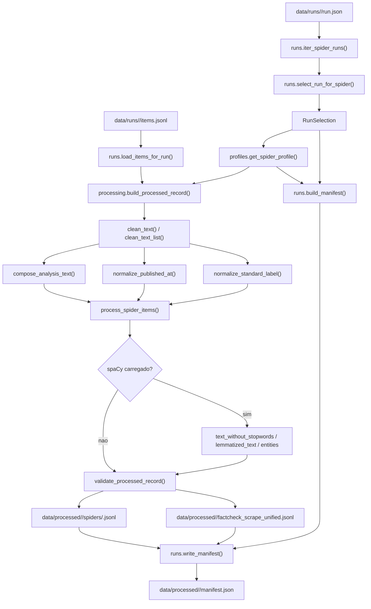
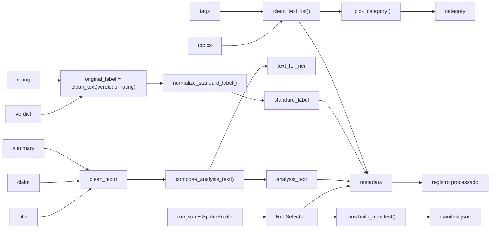

# Analysis

## Objetivo
Este documento descreve as regras de negocio do submodulo `src/factcheck_scrape/analysis/`. O foco aqui nao e ensinar a executar notebooks, mas explicar como o projeto decide:

- qual `run` entra na analise;
- como os campos brutos sao limpos e reinterpretados;
- quais pressupostos sustentam o snapshot processado;
- o que entra no `manifest.json` e no corpus final em `data/processed/`.

O submodulo foi desenhado para transformar saidas brutas de scraping em um dataset analitico mais estavel e comparavel entre spiders, sem reimplementar essa logica dentro dos notebooks.

## Posicao no pipeline
O `analysis` opera depois da coleta bruta. Ele parte de dois artefatos principais:

- `data/runs/<run_id>/run.json`: metadados operacionais do run e de cada spider.
- `data/runs/<run_id>/items.jsonl`: itens brutos persistidos pelo pipeline de coleta.

O resultado e um snapshot processado em `data/processed/<snapshot_id>/`, com export por spider, export unificado e manifesto.

## Contrato de entrada bruto
O contrato bruto formal continua sendo `docs/schema.json`. O `analysis` nao redefine esse schema; ele parte dele.

### Campos brutos usados diretamente
Os campos abaixo participam da transformacao processada:

| Campo bruto | Uso principal no `analysis` |
| --- | --- |
| `item_id` | Base de `source_record_id` e `record_id` |
| `spider` | Escolha de perfil e `dataset_id` |
| `source_url` | Copiado para `source_url` processado |
| `published_at` | Normalizado para ISO 8601 UTC |
| `title` | Compoe `analysis_text`; tambem pode ser criterio de descarte |
| `claim` | Vira `claim_text` e participa de `analysis_text` |
| `summary` | Vira `body_text` e participa de `analysis_text` |
| `verdict` / `rating` | Base de `original_label` e `standard_label` |
| `language` | Copiado apos limpeza |
| `topics` / `tags` | Limpados, deduplicados e usados em `category` e `metadata` |
| `source_type` | Copiado para `metadata.source_type` |

### Campos operacionais usados diretamente
Os metadados de `run.json` entram na selecao e no rastreamento:

| Campo em `run.json` | Uso |
| --- | --- |
| `run_id` | Ordenacao, diagnostico e rastreabilidade |
| `items_stored` | Parte do criterio de validade do run |
| `started_at` / `finished_at` | Disponiveis no diagnostico de run, mas nao no registro processado |
| `agency_id` / `agency_name` por spider | Propagados para `metadata` e `manifest.json` |

### Campos que o `analysis` aceita, mas o schema bruto atual nao garante
`build_processed_record()` tambem tenta ler `author` e `subtitle`. Como esses campos nao aparecem no `docs/schema.json` atual, o comportamento esperado hoje e que eles saiam `null` na maior parte dos snapshots. O modulo aceita esses campos para manter o contrato processado estavel caso o schema bruto evolua no futuro.

## Regras de negocio da selecao de run
As regras de selecao vivem em `runs.py` e foram feitas para privilegiar reproducibilidade sem esconder falhas recentes.

### 1. Descoberta dos runs
- O modulo percorre `data/runs/*/run.json`.
- Diretorios sem `run.json` sao ignorados.
- Arquivos `run.json` ilegiveis ou com JSON invalido sao tratados como inexistentes.
- Cada `run.json` pode gerar mais de um `SpiderRunRecord`, um por spider registrada naquele run.

### 2. Ordenacao
- Os runs de uma spider sao ordenados por `run_id`.
- Isso funciona porque o projeto usa `run_id` com prefixo temporal UTC no formato `YYYYMMDDTHHMMSSZ`, que e lexicograficamente ordenavel.
- A regra pressupoe que novos runs continuem seguindo esse padrao.

### 3. O que significa "run valido"
Um run e considerado valido para export apenas quando as duas condicoes abaixo sao verdadeiras:

1. `items_stored > 0`
2. `items.jsonl` existe e tem tamanho maior que zero

Ou seja, volume declarado sem arquivo de itens nao basta, e arquivo existente mas vazio tambem nao basta.

### 4. Politica de fallback
- Se o run mais recente da spider for valido, ele e selecionado.
- Se o run mais recente nao for valido, mas existir um run anterior valido, o modulo faz fallback para o `latest_valid_run`.
- Se nenhum run valido existir, o modulo ainda preserva o `latest_run` como `selected_run`, com `selection_reason = "latest_run_without_valid_items"`.

Essa ultima regra e deliberada: o sistema prefere manter a spider visivel no diagnostico do snapshot, mesmo quando nao ha material exportavel.

### 5. O que vai para o manifesto
Cada spider recebe no `manifest.json`:

- `selected_run_id`
- `latest_run_id`
- `latest_valid_run_id`
- `fallback_applied`
- `selection_reason`
- `exported_records`
- `cleaning_flags`
- `diagnostic_run_ids`
- `agency_id`
- `agency_name`

`cleaning_flags` e `diagnostic_run_ids` nao dirigem a transformacao no momento da exportacao; eles funcionam como trilha declarativa para notebooks, auditoria e leitura humana.

## Perfis por spider e por que eles existem
As spiders publicam textos com estilos editoriais diferentes. O `analysis` encapsula essas diferencas em `profiles.py` para evitar regras espalhadas em notebooks.

Cada `SpiderProfile` pode alterar:

| Campo do perfil | Efeito |
| --- | --- |
| `analysis_field_order` | Ordem de composicao de `analysis_text` |
| `ignored_analysis_titles` | Titulos genericos que nao entram em `analysis_text` |
| `dropped_export_titles` | Titulos que fazem o item ser descartado do export |
| `extract_label_prefix_before_colon` | Usa apenas o prefixo do veredito antes de `:` |
| `diagnostic_run_ids` | Runs marcados para analise diagnostica em notebooks |
| `cleaning_flags` | Marcadores declarativos do que e especial naquela spider |

### Regras especiais atualmente implementadas
- `observador`
  - muda a ordem de composicao para `claim`, `summary`, `title`;
  - ignora o titulo generico `Observador` quando ele nao agrega informacao.
- `afp_checamos`
  - descarta itens com titulo `como trabalhamos`.
- `aos_fatos`
  - descarta itens com titulo `ultimas noticias` e a variante acentuada equivalente.
- `projeto_comprova`
  - antes de classificar o veredito, usa apenas o prefixo semantico anterior a `:`.
- `publico`
  - sinaliza que a spider aceita datas em RFC 822, algo refletido em `normalize_published_at()`.
- `g1_fato_ou_fake`
  - depende do mapeamento direto de `FAKE` e `FATO` para a taxonomia compacta.
- `uol_confere`
  - preserva `diagnostic_run_ids` para tornar auditavel o caso conhecido em que o run mais recente ficou vazio e um run anterior precisou ser usado.

## Regras de limpeza textual
As funcoes `clean_text()` e `clean_text_list()` implementam uma limpeza leve, orientada a preservar legibilidade e reduzir ruido sem reescrever demais o texto original.

### `clean_text()`
Para cada valor textual:

1. converte o valor para `str`, se necessario;
2. aplica `html.unescape`;
3. tenta corrigir mojibake apenas se o texto resultante parecer objetivamente melhor;
4. normaliza Unicode em `NFKC`;
5. troca `nbsp` por espaco simples;
6. colapsa whitespace consecutivo;
7. remove espacos nas bordas;
8. devolve `null` se o texto final ficar vazio;
9. devolve `null` se o texto corresponder a placeholders como `-`, `none`, `null`, `nan` e `n/a`;
10. opcionalmente converte para minusculas.

### Heuristica de mojibake
O modulo nao tenta "consertar encoding" de forma agressiva. Ele so faz a conversao `latin-1 -> utf-8` quando o texto parece contaminado por marcadores tipicos de mojibake, como `Ã`, `Â`, `â` ou `\ufffd`, e apenas se a versao candidata reduzir essa contagem.

Essa escolha evita duas falhas opostas:

- deixar textos obviamente corrompidos passarem intocados;
- piorar textos que ja estavam corretos.

### `clean_text_list()`
Listas como `topics` e `tags` passam por:

- limpeza item a item via `clean_text()`;
- remocao de vazios;
- deduplicacao case-insensitive;
- preservacao da primeira ocorrencia.

Essa ordem importa porque `category` depende do primeiro elemento util.

## Composicao de `analysis_text`
`analysis_text` e o texto analitico central do snapshot. Ele serve de base para leitura humana, NER, remocao de stopwords e lematizacao.

### Regras de composicao
- Os candidatos sao `title`, `claim` e `summary`.
- A ordem vem do `SpiderProfile`.
- Cada campo e limpo individualmente antes de entrar na composicao.
- Titulos presentes em `ignored_analysis_titles` sao removidos.
- Duplicatas sao detectadas por comparacao case-insensitive.
- O texto final e unido com espaco simples e sempre convertido para minusculas.

### Consequencias praticas
- Se `title` e `claim` forem iguais, um deles cai fora.
- Se uma spider publicar um titulo editorial generico, esse titulo nao contamina o texto usado por NLP.
- O snapshot privilegia comparabilidade entre spiders, nao fidelidade tipografica total ao HTML original.

## Normalizacao de `published_at`
`normalize_published_at()` aceita tres familias de entrada:

- ISO 8601 completo, inclusive com sufixo `Z`;
- data simples no formato `YYYY-MM-DD`;
- datas RFC 822, como as usadas por `publico`.

### Regras aplicadas
- datas ISO sem timezone sao assumidas como UTC;
- datas simples viram meia-noite em UTC;
- datas RFC 822 sem timezone tambem passam a UTC;
- qualquer valor invalido ou placeholder resulta em `null`.

O objetivo nao e reconstruir a timezone editorial original, e sim produzir um campo temporal consistente para agregacao, ordenacao e comparacao.

## Normalizacao de veredito e taxonomia `standard_label`
`normalize_standard_label()` transforma ruidos editoriais em uma taxonomia curta e estavel:

| `standard_label` | Intencao |
| --- | --- |
| `true` | conteudo validado como verdadeiro |
| `false` | conteudo classificado como falso |
| `misleading` | conteudo parcialmente correto, descontextualizado ou enganoso |
| `unverified` | ausencia de evidencia suficiente |
| `satire` | satira, humor ou rotulo editorial equivalente |
| `other` | rotulos nao classificaveis, ruidos editoriais, URLs ou numeros |
| `missing` | ausencia total de rotulo util |

### Regras de classificacao
1. Se o rotulo estiver vazio apos limpeza, o resultado e `missing`.
2. Se o perfil pedir extracao por prefixo, so o trecho antes de `:` entra como rotulo semantico.
3. O texto e normalizado por:
   - minusculas;
   - remocao de acentos;
   - substituicao de separadores por `_`;
   - preservacao de `:` quando ela faz parte da heuristica de prefixo.
4. Se o rotulo semantico parecer uma URL ou um numero puro, o resultado e `other`.
5. A classificacao consulta grupos de chaves conhecidas para `true`, `false`, `misleading`, `unverified`, `satire` e `other`.
6. Prefixos como `enganoso:` e `contextualizando:` tambem caem em `misleading`.
7. Qualquer caso residual vai para `other`.

### Observacoes importantes
- `original_label` vem de `verdict` ou, se ele estiver ausente, de `rating`.
- `metadata.source_rating` preserva especificamente o valor de `rating`, mesmo quando `original_label` veio de `verdict`.
- O modulo privilegia estabilidade taxonomica, nao granularidade maxima do vocabulario editorial de cada veiculo.

## Como os campos processados sao derivados
O contrato processado e montado em `build_processed_record()`.

### Derivacoes centrais
| Campo processado | Regra |
| --- | --- |
| `record_id` | `factcheck_scrape_<spider>:<item_id>` |
| `source_record_id` | `item_id` convertido para string |
| `dataset_id` | `factcheck_scrape_<spider>` |
| `claim_text` | `claim` apos `clean_text()` |
| `body_text` | `summary` apos `clean_text()` |
| `analysis_text` | composicao normalizada de `title`, `claim` e `summary` |
| `text_for_ner` | copia literal de `analysis_text` |
| `original_label` | `clean_text(verdict or rating)` |
| `standard_label` | taxonomia compacta derivada de `original_label` |
| `category` | primeiro valor util de `topics`; senao primeiro de `tags`; senao `null` |
| `variant` | sempre `claim_summary` |

### Metadados preservados
`metadata` existe para manter contexto operacional sem poluir a camada principal do contrato. Ele inclui:

- `analysis_text_length`
- `entity_count`
- `spider`
- `agency_id`
- `agency_name`
- `run_id`
- `latest_run_id`
- `fallback_applied`
- `source_type`
- `source_topics`
- `source_tags`
- `source_rating`

Note a diferenca entre:

- `run_id`: o run efetivamente usado no export;
- `latest_run_id`: o run mais recente observado para a spider, mesmo quando houve fallback.

## Descarte de itens durante o processamento
O `analysis` nao tenta fazer filtragem semantica ampla no snapshot processado. O descarte atual e propositalmente estreito:

- ele acontece em `should_drop_item()`;
- a decisao e tomada com base no `title` limpo;
- apenas titulos explicitamente listados em `dropped_export_titles` fazem o item sair do export.

Isso reduz o risco de apagar conteudo legitimo com heuristicas opacas. Hoje, o modulo remove apenas casos editoriais conhecidos e repetitivos.

## Enriquecimento opcional com spaCy
`process_spider_items()` aceita um pipeline NLP opcional.

### Sem spaCy
Quando `nlp` e `None`:

- `text_without_stopwords` permanece como string vazia;
- `lemmatized_text` recebe o proprio `analysis_text`;
- `entities` permanece vazia;
- `entity_count` fica em `0`.

Essa regra permite produzir snapshot processado mesmo sem dependencia NLP instalada.

### Com spaCy
Quando um modelo e fornecido:

- `nlp.pipe()` processa `text_for_ner` em lotes;
- `text_without_stopwords` remove espacos, pontuacao e tokens marcados como stopwords;
- `lemmatized_text` usa `lemma_` em minusculas e cai para o token original quando a lemma nao e util;
- `entities` vira uma lista de objetos com `text`, `label`, `start_char` e `end_char`;
- `metadata.entity_count` passa a refletir o tamanho real de `entities`.

O modulo usa NLP como enriquecimento, nao como etapa obrigatoria de validade.

## Validacao do contrato processado
`validate_processed_record()` protege o contrato final por invariantes simples e explicitas.

### O que e validado
- todos os campos listados em `PROCESSED_RECORD_FIELDS` precisam existir;
- `variant` precisa ser exatamente `claim_summary`;
- `entities` precisa ser uma lista;
- `metadata` precisa ser um objeto;
- `metadata.analysis_text_length` precisa bater com o tamanho real de `analysis_text`;
- `metadata.entity_count` precisa bater com a quantidade real de entidades.

### O que essa validacao nao tenta fazer
- nao valida qualidade semantica do texto;
- nao valida se a classificacao editorial esta "certa";
- nao checa unicidade entre spiders;
- nao impoe schema JSON externo para o snapshot.

A escolha aqui foi manter uma validacao pequena, legivel e focada em consistencia estrutural.

## Saidas do snapshot processado
`build_processed_snapshot()` produz tres artefatos principais:

| Artefato | Conteudo |
| --- | --- |
| `data/processed/<snapshot_id>/spiders/<spider>.jsonl` | export individual por spider |
| `data/processed/<snapshot_id>/factcheck_scrape_unified.jsonl` | concatenacao simples dos registros de todas as spiders selecionadas |
| `data/processed/<snapshot_id>/manifest.json` | resumo do snapshot e diagnostico por spider |

### Ordem e composicao do snapshot
- Se nenhuma lista explicita de spiders for passada, a ordem segue `SPIDER_ORDER`.
- Spiders extras fora dessa tupla entram ao final, em ordem alfabetica.
- O export unificado apenas concatena os registros por spider na ordem de selecao.
- Nao ha deduplicacao cruzada entre spiders nessa etapa.

Essa decisao preserva a rastreabilidade do que cada spider publicou, mesmo que duas fontes tratem a mesma alegacao.

## Pressupostos e limites conscientes
O submodulo assume algumas coisas de forma deliberada:

- o `run_id` continua seguindo um formato temporal ordenavel;
- o pipeline bruto ja cuidou de schema e deduplicacao intra-agencia antes do `analysis`;
- linhas JSON invalidas em `items.jsonl` podem ser ignoradas silenciosamente na leitura;
- `author` e `subtitle` podem permanecer nulos por falta de suporte no schema bruto atual;
- `cleaning_flags` documentam comportamento, mas nao executam transformacoes sozinhos;
- o snapshot processado privilegia comparabilidade e rastreabilidade, nao reproducao literal do HTML de origem.

## Leitura complementar
- `src/factcheck_scrape/analysis/runs.py`
- `src/factcheck_scrape/analysis/processing.py`
- `src/factcheck_scrape/analysis/profiles.py`
- `tests/test_analysis.py`
- `docs/design.md`
- `docs/schema.json`
