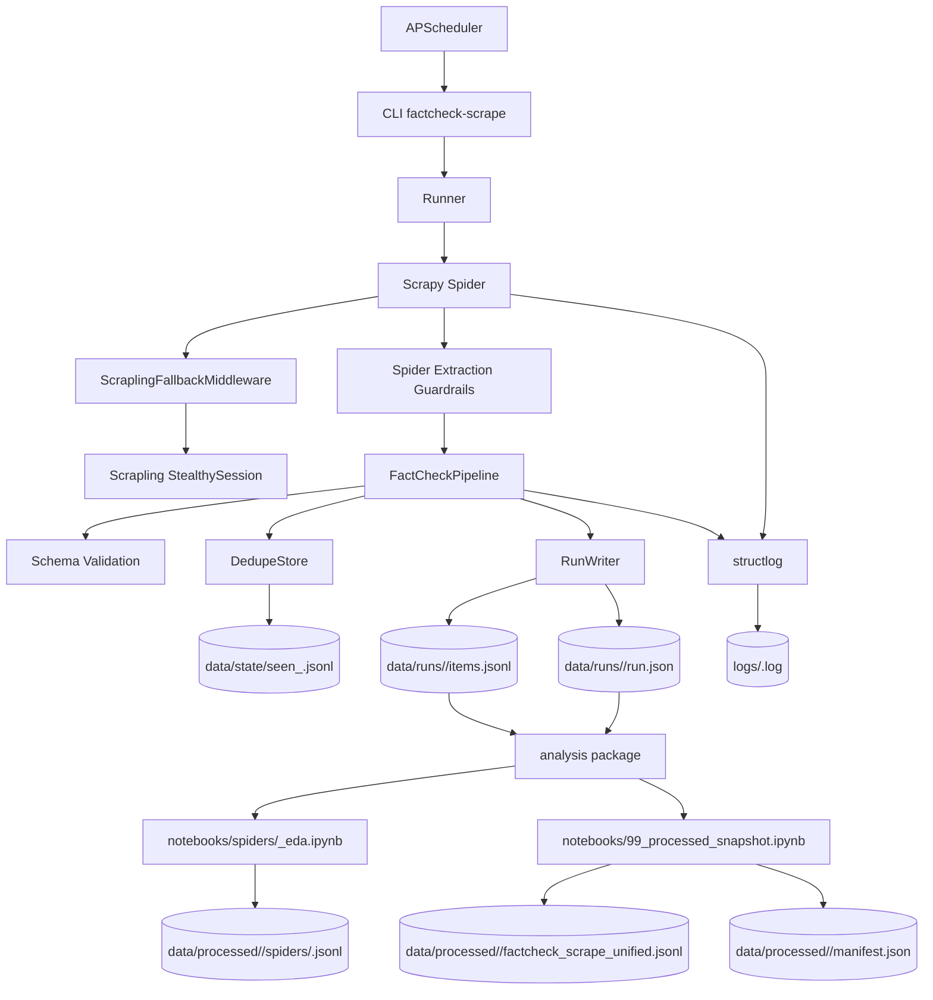

# Design

## Visao geral
O projeto usa Scrapy para executar spiders por agencia, com um pipeline unico que valida schema, deduplica por URL canonica e grava dados em JSONL por execucao. O agendamento usa APScheduler e dispara processos isolados para evitar conflitos com o reactor do Scrapy.

No estado atual, a protecao de qualidade comeca na propria coleta. Cada spider valida os campos centrais antes de chamar `build_item(...)` e descarta paginas com `title` ou `published_at` invalidos, em vez de persistir placeholders e deixar toda a correcao para a etapa de analise. O pipeline continua aplicando a validacao de schema e um backstop conservador para impedir que spiders futuras gravem itens degradados.

Para requests opt-in, o caminho de download tambem pode acionar um fallback com Scrapling. No estado atual, isso fica habilitado para requests das spiders `observador` e `reuters_fact_check` quando o Scrapy recebe uma resposta que aparenta bloqueio anti-bot. As spiders tambem evitam persistir paginas de desafio ou respostas bloqueadas como se fossem noticias validas e podem ser reexecutadas ignorando o estado historico de deduplicacao para corrigir coletas corrompidas.

O repositorio agora tambem inclui uma trilha de analise por spider. Essa trilha usa `src/factcheck_scrape/analysis/` para selecionar runs, limpar texto, normalizar datas e labels, aplicar NLP com spaCy e exportar datasets processados em JSONL, sem mover essa logica para dentro dos notebooks.

## Arquitetura

## Layout de pastas
- `src/factcheck_scrape/` codigo do pipeline
- `src/factcheck_scrape/spiders/` spiders por agencia
- `src/factcheck_scrape/analysis/` selecao de runs, limpeza, normalizacao, NLP e export processado
- `configs/` arquivos de agendamento
- `docs/` documentacao e schema
- `notebooks/` notebooks gerais, notebooks por spider e snapshot final
- `data/` saidas de execucao e snapshots processados
- `logs/` logs estruturados

## Modulo de analise processada
O pacote `src/factcheck_scrape/analysis/` foi separado em componentes pequenos:
- `profiles.py`: regras explicitas por spider para selecao, limpeza e normalizacao.
- `runs.py`: leitura de `run.json`, agrupamento por spider, fallback para o run mais recente valido e geracao de manifesto.
- `processing.py`: limpeza textual, parsing de datas, composicao de `analysis_text`, taxonomia de labels, NLP e export JSONL.

Esse modulo foi desenhado para ser reutilizavel em notebooks e testavel em isolamento, incluindo smoke tests do `manifest.json` e do contrato final de saida.

Para uma explicacao detalhada das regras de negocio, dos pressupostos e do fluxo `raw -> processed`, consulte `docs/analysis.md`.

## Politica de selecao de run
- A analise parte do run mais recente por spider.
- Se o run mais recente tiver `items_stored == 0`, `items.jsonl` ausente ou estiver vazio, a selecao cai para o run mais recente valido daquela spider.
- Diretorios sem `run.json` nao entram na selecao.
- O manifesto registra `selected_run_id`, `latest_run_id`, `latest_valid_run_id` e `fallback_applied`.

## Regras de limpeza e normalizacao
- `html.unescape`, normalizacao Unicode, colapso de whitespace e correcao leve de mojibake sao aplicados a campos textuais.
- `analysis_text` combina `title`, `claim` e `summary` em minusculas com deduplicacao simples e ordem definida por perfil.
- `observador` ignora o titulo generico `Observador` e prioriza `claim + summary`.
- `afp_checamos` e `aos_fatos` descartam linhas claramente nao editoriais, como `Como trabalhamos` e `Ultimas noticias`.
- `publico` normaliza `published_at` em RFC 822 para ISO 8601 UTC.
- `projeto_comprova` extrai o prefixo semantico do veredito antes de `:` para mapear `standard_label`.
- `g1_fato_ou_fake` faz mapeamento direto de `FAKE` e `FATO`.

## Guardrails de extracao
- `BaseFactCheckSpider` concentra helpers compartilhados para JSON-LD, canonicalizacao, taxonomia, `ClaimReview` e validacao de campos essenciais.
- A regra minima para persistir um artigo agora exige `title` e `published_at` validos. Titulos vazios, titulos iguais a URL e datas placeholder como `-`, `–` e `—` sao descartados ainda na spider.
- A normalizacao de `ClaimReview` separa `verdict` de `rating`: apenas labels humanas entram em `verdict`; valores numericos ficam restritos a `rating`.
- O pipeline replica essas verificacoes como backstop, para que o contrato de qualidade nao dependa apenas da disciplina de cada spider.

## Dataset processado
Cada export processado inclui:
- `record_id`, `source_record_id`, `dataset_id`
- `source_url`, `published_at`, `language`, `title`, `author`, `subtitle`
- `claim_text`, `body_text`, `analysis_text`, `text_for_ner`
- `text_without_stopwords`, `lemmatized_text`
- `original_label`, `standard_label`, `category`
- `entities`
- `variant`
- `metadata`

O `manifest.json` registra o snapshot e o resumo por spider, incluindo flags de limpeza relevantes e a contagem de registros exportados.

## Schema de saida bruta
O schema padronizado da coleta continua em `docs/schema.json`.
