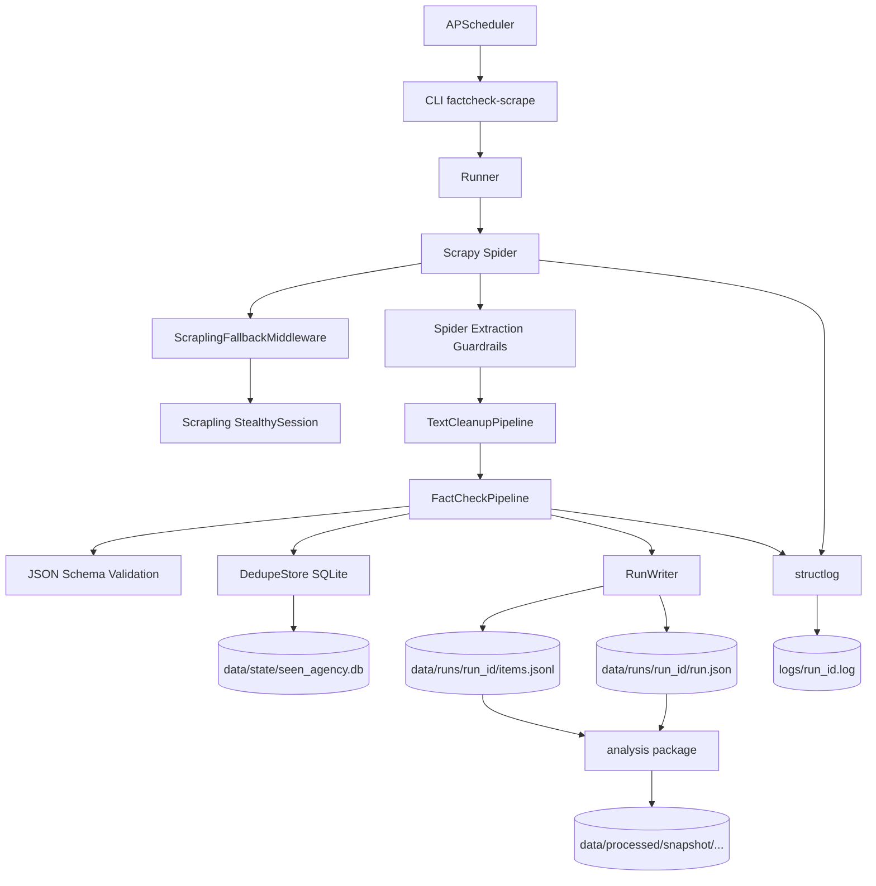

# Design

## Visao geral

O projeto usa Scrapy para executar spiders por agencia, com dois pipelines em sequencia: `TextCleanupPipeline` (prioridade 200) normaliza texto antes do `FactCheckPipeline` (prioridade 300), que valida o schema via JSON Schema, deduplica por URL canonica (SQLite com WAL mode) e grava dados em JSONL por execucao.

O agendamento usa APScheduler e dispara processos isolados para evitar conflitos com o reactor do Scrapy. A execucao de todas as spiders roda ate 4 em paralelo via `ProcessPoolExecutor`.

Cada spider valida campos centrais antes de chamar `build_item()` e descarta paginas com `title` ou `published_at` invalidos. O pipeline replica essas verificacoes como backstop.

Para spiders que enfrentam protecao anti-bot (`observador`, `reuters_fact_check`), um middleware opt-in aciona fallback com Scrapling usando `real_chrome=True`.

O repositorio inclui um modulo de analise (`src/factcheck_scrape/analysis/`) para selecao de runs, limpeza, normalizacao, NLP com spaCy e export de datasets processados.

## Arquitetura



## Layout de pastas

```
src/factcheck_scrape/
  spiders/
    helpers/           # Funcoes puras: text, jsonld, claimreview, taxonomy
    base.py            # BaseFactCheckSpider (delega aos helpers)
    <spider>.py        # Uma spider por agencia
  analysis/            # Selecao de runs, limpeza, normalizacao, NLP, export
  cli.py               # Ponto de entrada CLI
  runner.py            # Executor (sequencial e paralelo)
  pipelines.py         # FactCheckPipeline
  text_cleanup.py      # TextCleanupPipeline (html.unescape, mojibake, NFKC)
  schema.py            # FactCheckItem dataclass (fonte unica do schema)
  storage.py           # RunWriter (items.jsonl + run.json)
  dedupe.py            # DedupeStore (SQLite WAL)
  quality.py           # Metricas de qualidade por spider
  report.py            # Relatorio de execucao
configs/               # Configuracoes de agendamento
docs/                  # Documentacao tecnica e schema
tests/                 # Testes unitarios, edge cases, integracao, smoke
data/                  # Runs brutos, estado de dedupe, snapshots processados
logs/                  # Logs estruturados por execucao
```

## Guardrails de extracao

- `BaseFactCheckSpider` concentra helpers compartilhados para JSON-LD, canonicalizacao, taxonomia, ClaimReview, author, body e validacao de campos essenciais.
- A regra minima para persistir um artigo exige `title` e `published_at` validos. Titulos vazios, titulos iguais a URL e datas placeholder sao descartados ainda na spider.
- A normalizacao de ClaimReview separa `verdict` de `rating`: apenas labels humanas entram em `verdict`; valores numericos ficam restritos a `rating`.

## Schema

O schema e derivado automaticamente da dataclass `FactCheckItem` em `schema.py`. A validacao usa `jsonschema.Draft202012Validator`. O JSON Schema gerado fica em `docs/schema.json`.

Campos obrigatorios: `item_id`, `agency_id`, `agency_name`, `spider`, `source_url`, `canonical_url`, `title`, `published_at`, `collected_at`, `run_id`.

Campos opcionais: `claim`, `summary`, `verdict`, `rating`, `author`, `body`, `language`, `country`, `topics`, `tags`, `entities`, `source_type`.
